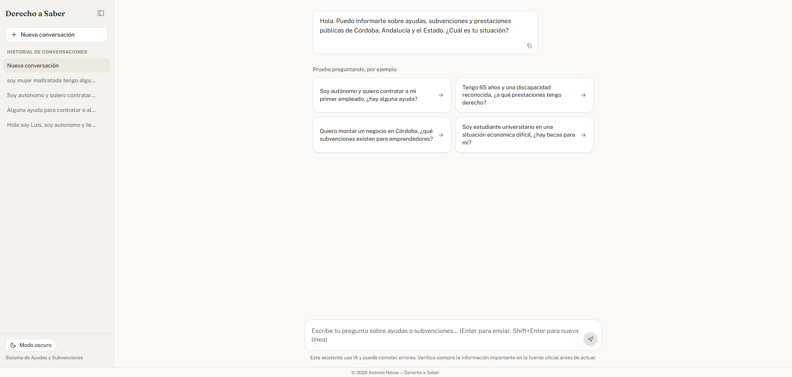
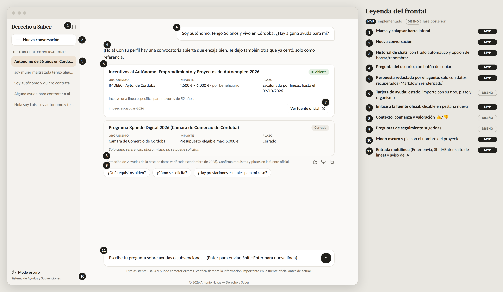
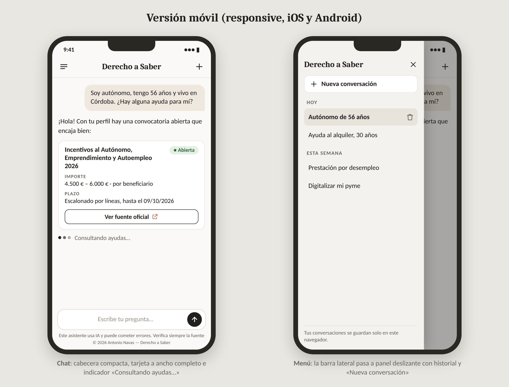

# Entrega 5 - Diseño del frontal y experiencia de usuario

> Esta entrega parte del frontal ya implementado: la aplicación
> React descrita en el README del repositorio (`tfm_app/frontend`) y desplegable según ahí se documenta (backend en Render con Docker, frontend en Vercel con el build nativo de Vite). Por eso la imagen principal es una captura real de la aplicación, no un boceto, y el resto de figuras están hechas con la misma paleta y tipografía para que se lean como parte de la misma interfaz.

## 1. Resumen de la solución y del usuario

- **Problema que resuelve.** Hay ayudas públicas a las que mucha gente tiene derecho y no pide, porque no sabe que existen, no entiende los requisitos o llega tarde al plazo. La información está repartida entre varios organismos (Córdoba, Andalucía y el Estado) y escrita en lenguaje administrativo.
- **Usuario principal.** Cualquier persona de Córdoba sin conocimientos de administración pública: autónomos, personas en desempleo, jóvenes que buscan alquiler, pensionistas, personas con discapacidad reconocida, estudiantes, pequeñas empresas, etc. El mensaje de bienvenida lo dice explícitamente: *"Puedo informarte sobre ayudas, subvenciones y prestaciones públicas de Córdoba, Andalucía y el Estado. ¿Cuál es tu situación?"*.
- **Necesidad y decisión.** Saber qué ayuda puede pedir en su situación, si está abierta y cómo solicitarla, para decidir **si la solicita y cuándo**.
- **Tipo de producto.** Un **asistente conversacional recomendador**: la persona describe su situación en un chat y recibe una recomendación de ayudas con su estado, importe, plazo y enlace oficial. Es la interfaz del sistema RAG con agente (LangGraph + FAISS + Gemini) descrito en las entregas anteriores.
- **Resultado o acción principal.** Una respuesta redactada por el agente que identifica las ayudas vigentes relevantes y permite ir a la fuente oficial para tramitarlas.

## 2. Imagen del frontal

**Pantalla principal (captura real de la aplicación).** Conversación nueva, con el mensaje de bienvenida y las preguntas de ejemplo que ayudan a arrancar la conversación:

**Pantalla secundaria: una conversación con resultados.** Recreada con el mismo estilo visual de la aplicación (misma tipografía, misma paleta neutra, mismos componentes), con una leyenda numerada que distingue lo ya implementado (MVP) de lo que queda como diseño para una fase posterior:

**Pantalla secundaria: versión móvil.** Vista de chat compacta y barra lateral como panel deslizante:

**Qué se ve en la pantalla principal (captura real)**

- **Marca y cabecera de la barra lateral**: el nombre del proyecto, "Derecho a Saber", en tipografía serif, con un botón para plegar la barra.
- **"Nueva conversación"**: botón siempre visible arriba de la barra lateral.
- **Historial de conversaciones**: cada entrada usa como título un fragmento de la primera pregunta del usuario (por ejemplo "soy mujer maltratada tengo algu…", "Hola soy Luis, soy autonomo y te…"), truncado con puntos suspensivos.
- **Mensaje de bienvenida** del asistente, con un botón de copiar.
- **Preguntas de ejemplo** ("Prueba preguntando, por ejemplo"): cuatro tarjetas con preguntas ya redactadas, pensadas para los perfiles más habituales (autónomo que contrata, persona con discapacidad, emprendedor, estudiante). Al pulsar una se envía directamente, sin que el usuario tenga que escribir desde cero.
- **Campo de entrada** multilínea, con la instrucción de uso integrada en el propio *placeholder* ("Enter para enviar, Shift+Enter para nueva línea").
- **Aviso de IA** y **pie con la autoría**, siempre visibles debajo del campo de entrada.
- **Modo oscuro** y el subtítulo "Sistema de Ayudas y Subvenciones", en la parte baja de la barra lateral.

**Qué añade la pantalla de una conversación con resultados**

- La respuesta del agente, con el estado de cada ayuda (Abierta, Cerrada), el importe con su significado, el plazo, el organismo y el botón "Ver fuente oficial".
- Una ayuda ya cerrada se muestra igualmente, pero marcada como referencia, con la advertencia de que no se puede solicitar.
- Una línea de contexto ("Información de N ayudas de la base de datos verificada…") con valoración positiva o negativa y la opción de copiar respuesta.

## 3. Justificación del diseño

### 3.1. Utilidad y valor de la solución

- **Qué permite resolver.** Pasar de "no sé qué ayudas existen" a "sé cuál pedir, hasta cuándo y dónde", con una sola pregunta escrita como se habla.
- **Qué mejora.**
  - *Tiempo:* evita revisar boletines y sedes de varios organismos; las preguntas de ejemplo reducen además el tiempo de "no sé cómo preguntar esto".
  - *Riesgo:* evita pedir una ayuda ya cerrada o confundir el presupuesto total de una convocatoria con lo que recibe cada persona.
  - *Resultado:* reduce que una ayuda a la que se tiene derecho se pierda por desconocimiento.
- **Información esencial en pantalla:** el nombre de la ayuda, su estado, el importe con su tipo, el plazo, el organismo y el enlace oficial. Es lo mínimo para decidir si merece la pena ir a la fuente.
- **Información que decidí no mostrar en la pantalla principal:** identificadores internos, la puntuación de similitud del motor de búsqueda y el detalle del funcionamiento del agente (el propio sistema no revela cómo está construido por diseño, según el *system prompt*). Los requisitos y la documentación se piden conversando ("¿qué requisitos piden?"), en vez de sobrecargar la respuesta inicial.
- **De resultado analítico a acción.** La recuperación y la generación terminan siempre en algo accionable: un botón a la fuente oficial. Las ayudas cerradas se muestran solo como referencia.

### 3.2. Flujo de usuario

1. **Punto de entrada.** El usuario abre la aplicación y ve el mensaje de bienvenida, las cuatro preguntas de ejemplo y el campo de entrada. En móvil, la barra lateral queda oculta y se abre con el icono de menú.
2. **Entradas.** Escribe su situación en lenguaje natural (edad, ocupación, localidad, lo que necesita) o pulsa directamente una de las preguntas de ejemplo. No hay formularios ni filtros manuales.
3. **Procesamiento** (no visible, salvo el indicador de escritura):
   - el agente extrae de la pregunta los filtros objetivos (ámbito, tipo de ayuda);
   - filtra el catálogo de 130 ayudas y busca por similitud dentro del subconjunto;
   - el estado de cada ayuda se calcula por código con la fecha de hoy, no por lo que diga el modelo de lenguaje;
   - el modelo de lenguaje (Gemini) redacta la respuesta usando **solo** las ayudas recuperadas.
4. **Resultado.** Recibe una explicación breve y las ayudas relevantes, con su estado. Sabe si puede confiar porque ve la fuente oficial y el aviso de que debe confirmarla; en las cerradas, ve una advertencia explícita de que ahora no se pueden solicitar.
5. **Acción.** Puede abrir la fuente oficial en una pestaña nueva, copiar la pregunta o la respuesta, pulsar una pregunta de seguimiento sugerida, renombrar o borrar una conversación (con confirmación antes de borrar), empezar una nueva o activar el modo oscuro.
6. **Excepciones**

| Situación | Qué ocurre |
|---|---|
| No hay ninguna ayuda relevante | El asistente lo dice claramente y pide más detalle; no inventa nada |
| Faltan datos en la pregunta | Recomienda con lo que hay y pide precisar |
| La ayuda tiene varias fases o no tiene fecha de fin exacta | Lo indica en el plazo ("escalonado por líneas", "revalidar") |
| Prestación de solicitud continua | Se presenta como "Permanente", sin fecha límite |
| La pregunta no es sobre ayudas, o intenta manipular al asistente | Responde con amabilidad que solo puede informar sobre ayudas y no revela su funcionamiento interno |
| Error de red o del servicio | Aviso de error con opción de reintentar, sin perder la conversación |
| El backend está "dormido" | Aparece un aviso de arranque en frío mientras el servicio despierta, en vez de dejar la pregunta sin respuesta |

### 3.3. Experiencia de usuario

- **Jerarquía visual.** Primero la pregunta y la respuesta; dentro de ella, la ayuda con su estado; por último, la acción ("Ver fuente oficial"). La caja de texto está siempre al final, como en cualquier chat.
- **Simplicidad.** Una sola pantalla, sin menús ni formularios. La barra lateral es plegable para que en pantallas pequeñas no estorbe. No hay métricas técnicas a la vista; las preguntas de ejemplo desaparecen en cuanto la conversación tiene su primer mensaje.
- **Legibilidad y consistencia.** Paleta neutra y clara (blancos y cremas, un único gris cálido para lo secundario, negro para el texto y las acciones principales), sin colores llamativos que compitan con el contenido. Los estados nunca dependen solo del color: llevan siempre su texto (Abierta, Cerrada, Permanente). El importe indica siempre su tipo, y las fechas usan el formato día/mes/año.
- **Contexto y confianza.** Cada ayuda cita su fuente oficial; la respuesta indica que procede de una base de datos verificada. No se muestra ningún porcentaje de confianza, porque la similitud interna del motor de búsqueda no equivale a una probabilidad de que la ayuda le corresponda a la persona.
- **Control del usuario.** Puede plegar la barra lateral, empezar una conversación nueva, renombrar una conversación (doble clic en el título), borrarla con confirmación previa, volver a las anteriores y alternar entre modo claro y oscuro. El historial se guarda **solo en su navegador** (persistencia en `localStorage`) y la memoria de la conversación en el servidor vive únicamente en la memoria del proceso del backend, sin base de datos que la persista.
- **Feedback del sistema.** Un indicador de escritura con puntos animados y texto que va cambiando, para que se note que hay un proceso real detrás. El campo de entrada es multilínea y se expande con el texto (Enter envía, Shift+Enter añade una línea), y cada respuesta del asistente tiene un botón para copiarla. Los errores se muestran con un mensaje comprensible y una opción de reintentar.
- **Accesibilidad y adaptación al dispositivo.** Diseño *responsive* para iOS y Android: en pantallas estrechas la barra lateral se convierte en un panel deslizante y el chat ocupa todo el ancho. Los enlaces externos se abren en pestaña nueva con las protecciones habituales, y el contraste del texto sobre el fondo claro es alto.

## 4. Presentación de resultados y explicabilidad

- **Resultado principal:** una recomendación de ayudas, ordenadas por relevancia, cada una con su estado.
- **Información que ayuda a interpretarlo:** el importe con su significado, el plazo (con su matiz si tiene varias fases o no tiene fecha de fin), el organismo, y el enlace oficial.
- **Cómo evito presentar una estimación como una certeza.** El lenguaje es prudente ("puede encajar", "confirma en la fuente"), el aviso de que es una IA está siempre visible bajo el campo de entrada, y el sistema nunca afirma que la persona tenga derecho a la ayuda: solo que parece adecuada según lo que ha contado.
- **Qué queda visible y qué se reserva.** En pantalla, lo necesario para decidir (estado, importe, plazo, fuente). La puntuación de similitud y los filtros que el agente ha aplicado quedan fuera de la interfaz; son datos internos del sistema, útiles para el análisis y la memoria del TFM, pero no para el usuario final.

**IA generativa como capa de explicación.** Sí se usa, con dos funciones acotadas, tal como quedó definido en el *system prompt* del agente:

1. **Extraer los filtros** (ámbito, tipo de ayuda) de la pregunta del usuario.
2. **Redactar la respuesta** en lenguaje claro a partir de las ayudas recuperadas.

Los controles que mantienen la trazabilidad son:

- el modelo solo puede hablar de lo que hay en el contexto recuperado y tiene prohibido inventar una ayuda, un importe o un plazo;
- la vigencia la calcula el código, no el modelo;
- cada ayuda citada lleva su enlace oficial;
- el asistente se limita al dominio de las ayudas, no revela su *prompt* ni su arquitectura interna, y no obedece instrucciones escondidas en la pregunta del usuario.

La IA generativa no sustituye al sistema de recuperación (FAISS + filtros) ni decide si una persona cumple los requisitos.

**Privacidad.** Lo que el usuario escribe se procesa a través de la API de Gemini, un servicio externo, y por eso conviene no escribir datos personales identificativos (nombre completo, DNI, dirección).

## 5. Alcance del MVP

Todo lo siguiente corresponde al frontal ya construido, con la estructura de componentes documentada en el README (`Sidebar.jsx`, `AreaChat.jsx`, `Mensaje.jsx`, `EntradaChat.jsx`, `TypingIndicator.jsx`, `AvisoError.jsx`, `BannerDespertando.jsx`, `PreguntasEjemplo.jsx`, y el hook `useConversaciones`):

| Elemento | Estado |
|---|---|
| Chat con entrada multilínea (Enter envía, Shift+Enter salto de línea) | **Implementado** |
| Indicador de escritura animado y aviso de que es una IA | **Implementado** |
| Barra lateral plegable, con "Nueva conversación", historial con título automático, y opción de renombrar y borrar (con confirmación) | **Implementado** |
| Preguntas de ejemplo al abrir una conversación nueva | **Implementado** |
| Respuestas en Markdown con enlaces clicables a la fuente oficial y botón de copiar | **Implementado** |
| Modo oscuro | **Implementado** |
| Diseño *responsive* para móvil (panel lateral deslizante) | **Implementado** |
| Aviso de arranque en frío del backend (plan gratuito de Render) | **Implementado** |
| Backend FastAPI (`/chat` y `/health`) con agente LangGraph y memoria de conversación por `thread_id` | **Implementado** |
| Ejecución con Docker Compose en local; despliegue en Render (backend) y Vercel (frontend) en producción | **Implementado**, según el README |
| Tarjetas visuales de ayuda (con insignia de estado, en vez de texto corrido) | Diseño (en el MVP, la misma información llega ya redactada dentro de la respuesta del agente) |
| Línea de contexto con valoración positiva / negativa y sugerencias de seguimiento como chips independientes | Diseño (parcialmente cubierto: la respuesta ya incluye la referencia a la base verificada en texto) |

**Tecnología.** React con Vite y `react-markdown` en el frontal (con el historial en `localStorage`); FastAPI, LangGraph, FAISS y embeddings locales (`multilingual-e5-small`) en el backend; Gemini (`gemini-3.5-flash-lite`) como modelo de lenguaje; Docker Compose para el entorno local, con backend en Render (contenedor Docker) y frontend en Vercel (build nativo de Vite) en producción.

**Siguiente paso si hay tiempo.** Hacer que `/chat` devuelva, además del texto, la lista estructurada de ayudas (`id`, `estado_calculado`, `importe_max`, `tipo_importe`, `fecha_fin`, `url_oficial`). Con eso el frontal podría pintar tarjetas visuales reales sin depender de que el modelo formatee bien el texto, que es el cambio de mayor valor para pasar del texto redactado a un componente de tarjeta propiamente dicho.
